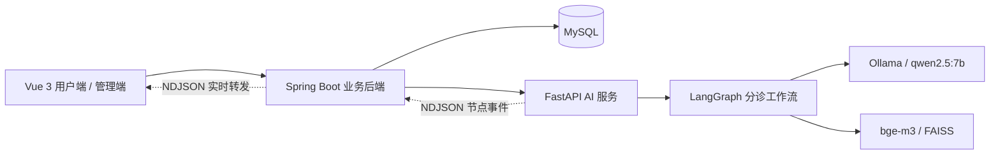
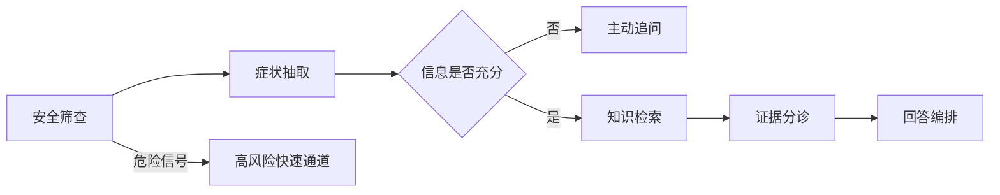
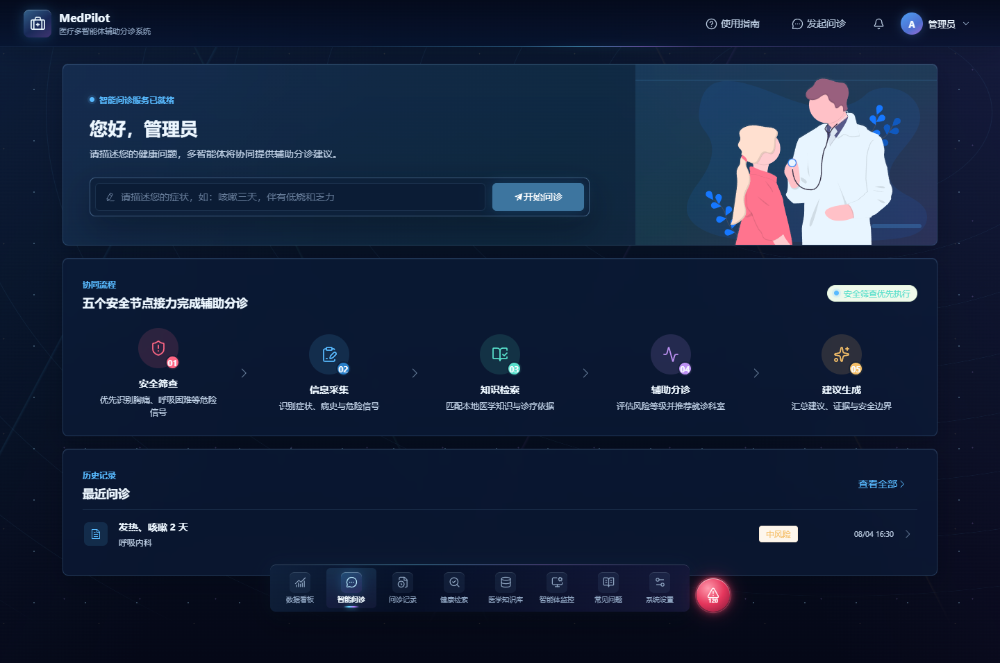
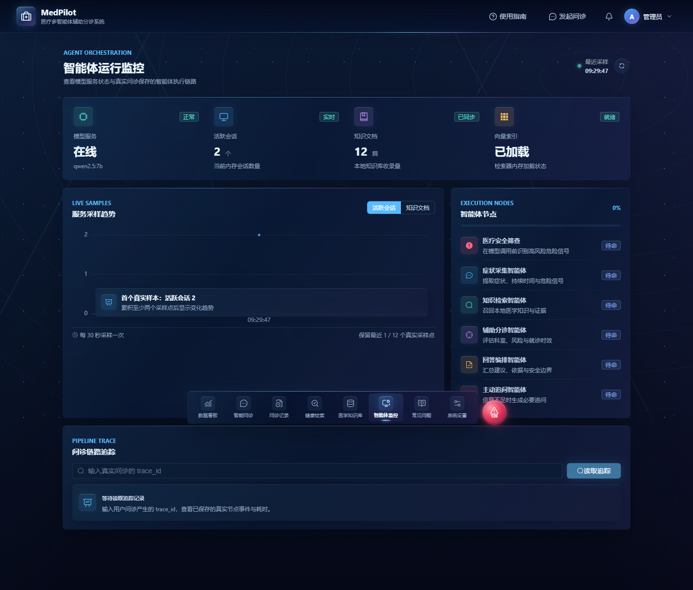

# MedPilot

[](https://github.com/chenghaodou71-stack/MedPilot/actions/workflows/ci.yml)


MedPilot 是本地运行的医疗多智能体辅助分诊系统，采用 `Vue 3 -> Spring Boot -> FastAPI -> Ollama/FAISS` 架构。系统通过固定职责的 LangGraph 节点完成症状采集、主动追问、本地医学知识检索、风险分级、科室推荐和带引用的结果编排。

> [!IMPORTANT]
> 本系统仅提供辅助分诊和就医时效建议，不提供疾病确诊、处方或用药指令，不替代执业医生的诊疗。

## 项目亮点

- **安全优先的条件 DAG**：模型调用前执行否定感知的危险信号筛查，信息不足时转入追问，高风险命中时进入紧急快速通道。
- **结构化智能体协作**：节点间使用不可变 Pydantic 模型传递症状、证据、分诊结果和回答，避免自由文本逐节点漂移。
- **可解释 RAG**：基于 `bge-m3 + FAISS` 检索审核通过的四专科知识，保留文档、分片、来源 URL 和索引版本等引用快照。
- **端到端 Trace**：通过 NDJSON 实时输出节点状态与耗时，后端严格验证事件序列并持久化成功或失败链路。
- **隐私与权限边界**：支持六类角色、HttpOnly JWT Cookie、CSRF 防护、内部服务令牌及 AES-256-GCM 医疗数据加密。
- **完整工程闭环**：包含多轮问诊、历史记录、健康档案、复诊提醒、知识治理、运行监控、审计及备份恢复。

## 系统架构





## 界面预览

### 智能问诊



### 智能体运行监控



## 开发环境

- Node.js 与 npm
- Java 17 与 Maven
- Python 3.11
- MySQL 8
- Ollama，已安装 `qwen2.5:7b` 与 `bge-m3`

Spring Boot 与 AI 服务必须使用相同的 `MEDPILOT_AI_SERVICE_TOKEN`；前端不得配置或发送该服务令牌。生产环境还必须显式提供至少 32 字节的 `JWT_SECRET`，以及 Base64 编码的 32 字节 `MEDPILOT_DATA_ENCRYPTION_KEY`。

默认/生产配置还必须显式提供 `DB_URL`、`DB_USER`、`DB_PASSWORD`；任一缺失都会导致后端启动失败。只有 `dev` profile 提供本机数据库默认值。

可用以下 PowerShell 片段生成数据加密密钥：

```powershell
$keyBytes = New-Object byte[] 32
[Security.Cryptography.RandomNumberGenerator]::Create().GetBytes($keyBytes)
[Convert]::ToBase64String($keyBytes)
```

## 启动

### 一键启动（Windows 开发环境）

确认 MySQL 与 Ollama 已启动，并已按“开发环境”章节安装依赖后，在项目根目录运行或双击：

```powershell
.\start-all.bat
```

启动器会检查依赖与端口，必要时构建 Spring Boot JAR，依次启动 AI 服务、后端和前端，并在三项 HTTP 可用性检查通过后打开 `http://127.0.0.1:5173/`。运行日志保存在 `.scratch/run/`。

启动器不会安装或修改 MySQL、Ollama 系统服务；如果 Ollama 缺少模型会先告警，AI 服务仍会启动，但 `GET /health` 在模型补齐前可能返回 `503`。

停止由启动器创建的三个项目进程：

```powershell
.\start-all.bat stop
```

需要强制重新构建后端或不自动打开浏览器时，可分别使用 `start-all.bat -Rebuild` 和 `start-all.bat -NoBrowser`。启动器固定使用 Spring Boot `dev` profile；生产环境仍应按下方手动配置显式密钥和数据库变量。

### 手动启动

1. 启动 Ollama，并确认模型可用：

```powershell
ollama list
```

2. 启动 AI 服务：

```powershell
cd ai-service
python -m venv venv
.\venv\Scripts\python.exe -m pip install -r requirements-dev.txt
$env:MEDPILOT_AI_SERVICE_TOKEN = 'medpilot-dev-service-token'
.\venv\Scripts\python.exe -m uvicorn main:app --host 127.0.0.1 --port 8000
```

`requirements-dev.txt` 同时安装运行依赖和 pytest 依赖；生产环境只需安装 `requirements.txt`。

3. 启动开发模式后端。`dev` profile 会幂等创建以下本地演示账号；这些账号和密码不得用于生产：

   `admin/admin123`（管理员）、`user/user123`（患者）、`editor/editor123`（知识编辑）、`reviewer/reviewer123`（审核）、`doctor/doctor123`（医生）、`auditor/auditor123`（审计）。

```powershell
cd backend
$env:SPRING_PROFILES_ACTIVE = 'dev'
$env:MEDPILOT_AI_SERVICE_TOKEN = 'medpilot-dev-service-token'
mvn package
.\start.bat
```

`start.bat` 从脚本所在目录启动 `target\medpilot-backend-0.1.0.jar`，未显式设置 profile 时默认使用 `dev`。当前项目位于中文路径时，`mvn spring-boot:run` 可能无法定位主类，因此以打包后运行脚本作为主启动方式。

生产启动前需显式设置 profile、数据库和密钥变量，例如：

```powershell
cd backend
$env:SPRING_PROFILES_ACTIVE = 'prod'
$env:DB_URL = 'jdbc:mysql://db-host:3306/medpilot?useSSL=true&serverTimezone=Asia/Shanghai&characterEncoding=utf8'
$env:DB_USER = 'medpilot'
$env:DB_PASSWORD = '<strong-password>'
$env:MEDPILOT_AI_SERVICE_TOKEN = '<shared-service-token>'
$env:JWT_SECRET = '<at-least-32-bytes>'
$env:MEDPILOT_DATA_ENCRYPTION_KEY = '<base64-encoded-32-byte-key>'
.\start.bat
```

4. 启动前端：

```powershell
cd frontend
npm.cmd install
npm.cmd run dev
```

访问 `http://127.0.0.1:5173`。AI readiness 位于 `GET /health`，只有 Ollama、聊天模型、嵌入模型和知识索引全部可用时才返回 `200`。

## 验证

```powershell
cd ai-service
.\venv\Scripts\python.exe -m pip install -r requirements-dev.txt
.\venv\Scripts\python.exe -m pytest -q -p no:cacheprovider

cd ..\backend
mvn test

cd ..\frontend
npm.cmd test
npm.cmd run build
npm.cmd audit --registry=https://registry.npmjs.org
```

### 离线医学评测

评测数据位于 `ai-service/evaluation/cases.json`。运行确定性安全基线会输出安全召回率、科室宏平均 F1、风险宏平均 F1、错误率以及 p50/p95 延迟；报告同时包含 Recall@K、MRR 和引用可追溯率（有检索金标准时自动计算）：

```powershell
cd ai-service
.\venv\Scripts\python.exe -m evaluation.evaluator --output-dir evaluation-results
```

命令默认向终端输出 JSON，并在输出目录写入 `metrics.json`、`case-results.csv` 和人类可读的 `summary.txt`。需要直接查看摘要时使用 `--format text`。检索评测结果可通过 `--outcomes`（别名 `--retrieval-outcomes`）叠加到安全基线；文件是按 `case_id` 匹配的 JSON 数组，最小格式如下：

```json
[
  {"case_id": "R1", "evidence_ids": ["resp-copd-overview#0", "resp-asthma-overview#0"]}
]
```

`evidence_ids` 的顺序必须与实际返回的排序一致，`--retrieval-k`（或 `--k`）控制 Recall@K。未提供带 `gold_evidence_ids` 的案例时，报告会将检索状态标为 `not-evaluated`，不会把缺少标注误报为模型失败。

评测指标用于规则与工程回归，不等同于临床准确率；真实模型运行和假模型/确定性基线必须分开记录。

安全与可靠性验收由仓库中的测试、CI 工作流与运维预检脚本共同保障；详细的本地验收产物不随代码提交。

### 运维脚本

生产或演示环境的备份、恢复和启动前检查集中在 `scripts/`：

```powershell
.\scripts\preflight.ps1
.\scripts\backup.ps1 -IncludeAttachments
.\scripts\restore.ps1 -BackupPath .\backups\<backup> -ConfirmRestore
```

备份会保存 MySQL、AI 索引和可选附件，并生成 `manifest.json` 哈希清单；恢复前会逐文件校验清单。完整的密钥轮换、保留策略、回滚顺序和医疗安全边界见 `docs/operations.md`。
